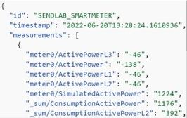

= Api MQTT Custom

Publishes OpenEMS Edge data to a MQTT broker.
Recieves data from a MQTT broker's topics.

Made based on SENDLab Broker requirements.

* `node/init`
** Topic used to initialize the node on the broker.
** MQTT message format:
*** type (String)
*** mode (String)
*** id (String)
*** name (String)
*** measurements (Array of arrays)
**** measurment (Array)
***** name (String)
***** description (String)
***** unit (String)
*** actuators (Array of arrays)
**** actuator (Array)
***** name (String)
***** description (String)
***** unit (String)

* `node/[nodeid]/message`
** nodeid = the id of the node, can be changed within the backend or ui configuration of the component.
** Result of the message sent to the broker on topic node/init.
*** example {"status": 1, "time": "2022-06-20T15:57:52.5565074+00:00", "message": "Welcome back to the network!"}

* `node/data`
** Topic used to send data to the node on the broker.
** MQTT message format:
*** id (String)
*** timestamp (String) [year-month-dayTHrs:min:sec.milsec] example: 2022-06-20T15:57:52.5565074 
*** measurements (Array of arrays) //Data that you would like on the broker. example [{"value":"data"},{"value":"moredata"}]

* `node/[nodeid]/data`
** nodeid = the id of the node, can be changed within the backend or ui configuration of the component.
** Result of the message sent to the broker on topic node/data.
** Data of Channels is published on change and at least every 5 minutes to these topics.

The diagram below is an example of how messages are receieved from the broker. Depending on the node type a new component will be needed.
This diagram uses the Smartmeter component. It also shows the communication between the edge device and the ui.

Orignal source branch (Temp)
[Branch code](https://github.com/AvansETI/SENDLAB/tree/OpeEms/feature/merge/OpenEMS/io.openems.edge.controller.api.mqtt.custom)

End destination
[Target source code](https://github.com/AvansETI/SENDLAB/tree/Development/OpenEMS/io.openems.edge.controller.api.mqtt.custom)